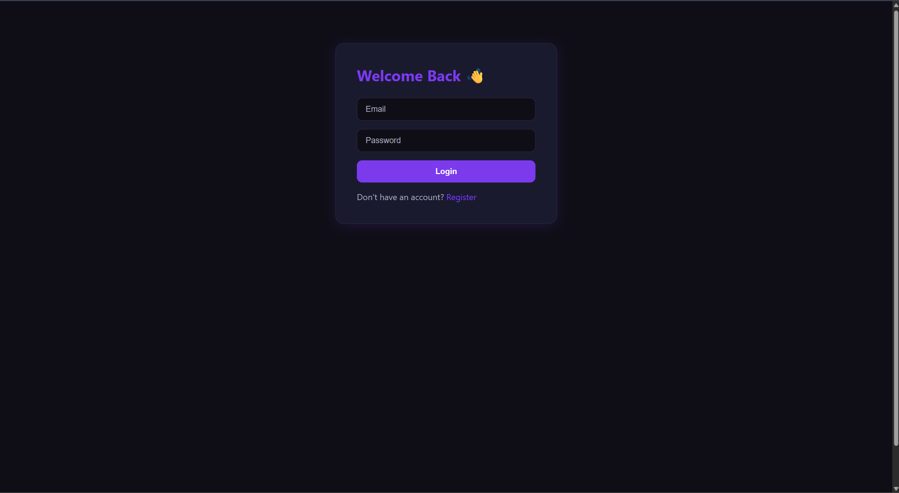
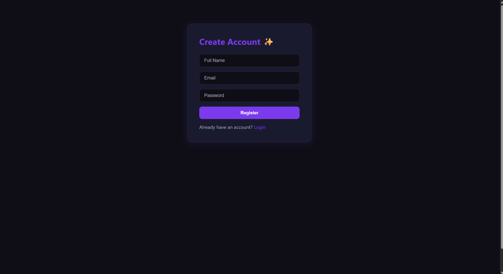
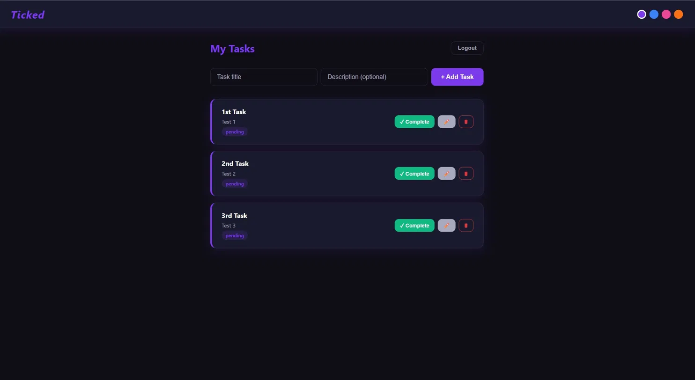
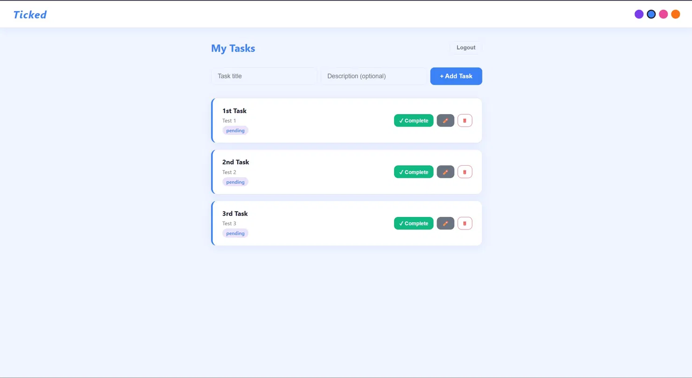
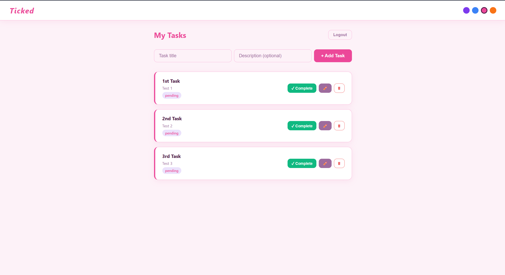
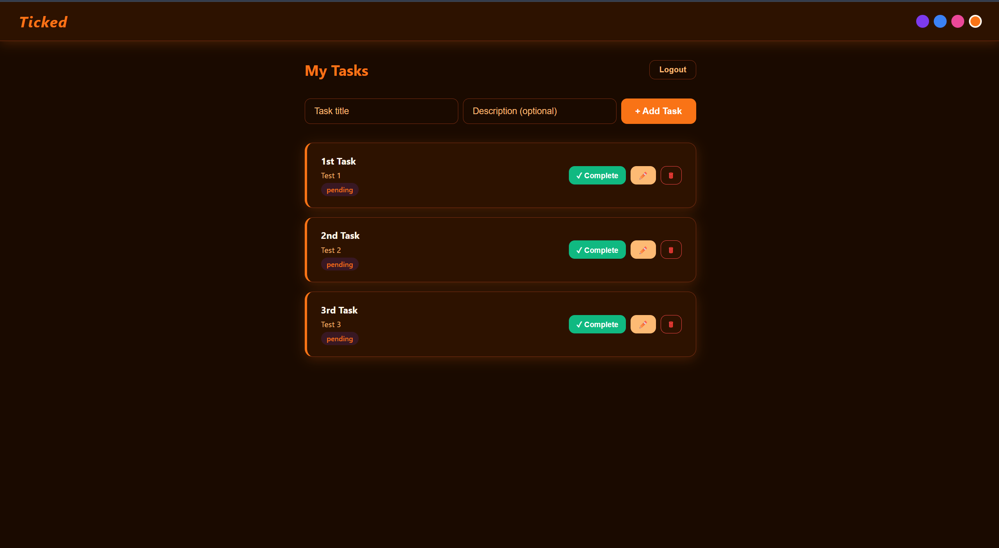

# Ticked ✓
A full-stack Task Management Web Application built with the MERN stack.

## Features
- User registration and login with JWT authentication
- Create, edit, delete, and view tasks
- Mark tasks as completed or pending
- 4 switchable themes: Dark, Light, Soft, Sunset
- Responsive UI with smooth animations
- Protected routes with middleware

## Tech Stack
- **Frontend:** React.js, Axios, React Router
- **Backend:** Node.js, Express.js
- **Database:** MongoDB Atlas
- **Authentication:** JWT + bcryptjs

## Setup Instructions

### Prerequisites
- Node.js installed
- MongoDB Atlas account

### Backend Setup
cd backend
npm install

Create a `.env` file in the backend folder:
MONGO_URI=your_mongodb_connection_string
JWT_SECRET=your_secret_key
PORT=5000

node server.js

### Frontend Setup
cd frontend
npm install
npm start

The app will run at `http://localhost:3000`

## Screenshots

### Login Page

### Register Page

### Dark Theme

### Light Theme

### Soft Theme

### Sunset Theme
